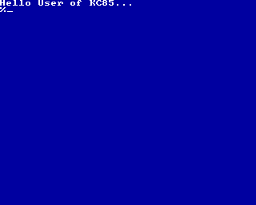

# KC85_SDCC_Hello_World
"Hello World"-Beispiel für KC85/4 mit dem Small Device C Compiler (SDCC)

Das Projekt zeigt den Einsatz des SDCC-Compilers um KCC-Dateien für die Kleincomputer aus Mühlhausen (KC85/3, KC85/4, KC85/5) zu erzeugen.
Dazu sind einige Anpassungen nötig (crt0.s, header.s, menuentry.s).
Außerdem gibt es eine Bibliothek, die ein angepasste printf-Funktion zur Verfügung stellt und eine Bibliothek, die Zugriff auf einige Unterprogramme des Betriebsystems CAOS erlaubt.

## Buildsystem
Um das Programm zu übersetzen werden folgende Werkzeuge benötigt:  
- make  
- sdcc  
- python3  

### Compilerausgabe

<pre>
make --directory lib_caos
make[1]: Verzeichnis „.../lib_caos“ wird betreten
Assemble: sdasz80  -plsgff  -o  caos_crt.rel caos_crt.s
Assemble: sdasz80  -plsgff  -o  caos_cstbt.rel caos_cstbt.s
Assemble: sdasz80  -plsgff  -o  caos_kbd.rel caos_kbd.s
Assemble: sdasz80  -plsgff  -o  caos_kbds.rel caos_kbds.s
Assemble: sdasz80  -plsgff  -o  caos_kbdz.rel caos_kbdz.s
Assemble: sdasz80  -plsgff  -o  caos_line.rel caos_line.s
Assemble: sdasz80  -plsgff  -o  caos_ton.rel caos_ton.s
Assemble: sdasz80  -plsgff  -o  caos_wait.rel caos_wait.s
Assemble: sdasz80  -plsgff  -o  caos_winak.rel caos_winak.s
Assemble: sdasz80  -plsgff  -o  caos_winin.rel caos_winin.s
Assemble: sdasz80  -plsgff  -o  colorup.rel colorup.s
Library: sdar  -rc caos.lib    caos_crt.rel caos_cstbt.rel caos_kbd.rel caos_kbds.rel caos_kbdz.rel caos_line.rel caos_ton.rel caos_wait.rel caos_winak.rel caos_winin.rel colorup.rel
cp caos.lib ..
cp caos.h ..
make[1]: Verzeichnis „.../lib_caos“ wird verlassen
make --directory lib_printf
make[1]: Verzeichnis „.../lib_printf“ wird betreten
Assemble: sdasz80  -plsgff  -o  _putchar.rel _putchar.s
Assemble: sdasz80  -plsgff  -o  __sdcc_call_hl.rel __sdcc_call_hl.s
Assemble: sdasz80  -plsgff  -o  strlen.rel strlen.s
Compile: sdcc     -mz80  --fomit-frame-pointer       -Wall  -S   _mulint.c   -o _mulint.asm
Assemble: sdasz80  -plsgff  -o  _mulint.rel _mulint.asm
Compile: sdcc     -mz80  --fomit-frame-pointer       -Wall  -S   printf_large.c   -o printf_large.asm
Assemble: sdasz80  -plsgff  -o  printf_large.rel printf_large.asm
Compile: sdcc     -mz80  --fomit-frame-pointer       -Wall  -S   puts.c   -o puts.asm
Assemble: sdasz80  -plsgff  -o  puts.rel puts.asm
Compile: sdcc     -mz80  --fomit-frame-pointer       -Wall  -S   vprintf.c   -o vprintf.asm
Assemble: sdasz80  -plsgff  -o  vprintf.rel vprintf.asm
Library: sdar  -rc printf.lib    _putchar.rel __sdcc_call_hl.rel strlen.rel _mulint.rel printf_large.rel puts.rel vprintf.rel
cp printf.lib ..
rm vprintf.asm puts.asm _mulint.asm printf_large.asm
make[1]: Verzeichnis „.../lib_printf“ wird verlassen
Assemble: sdasz80  -plsgff  -o  crt0.rel crt0.s
Assemble: sdasz80  -plsgff  -o  header.rel header.s
Assemble: sdasz80  -plsgff  -o  menuentry.rel menuentry.s
Compile: sdcc     -mz80  --fomit-frame-pointer -Wall  -S   hello.c   -o hello.asm
Assemble: sdasz80  -plsgff  -o  hello.rel hello.asm
Link: sdldz80  -mjwx  -b _KCC_HEADER=0x180 -b _CODE=0x200  -l caos.lib  -l printf.lib -i HELLO.ihx  crt0.rel header.rel menuentry.rel hello.rel
ASlink >> -m
ASlink >> -j
ASlink >> -w
ASlink >> -x
ASlink >> -b _KCC_HEADER=0x180
ASlink >> -b _CODE=0x200
ASlink >> -l caos.lib
ASlink >> -l printf.lib
ASlink >> -i
ASlink >> HELLO.ihx
ASlink >> crt0.rel
ASlink >> header.rel
ASlink >> menuentry.rel
ASlink >> hello.rel
sdobjcopy  -I ihex -O binary   HELLO.ihx  HELLO.kcc
python3 fix_kcc_length.py  HELLO.kcc
fix_kcc_length.py: HELLO.kcc enhanced by 118 bytes.
rm hello.asm
</pre>

## Ergebnis

## Dateien

| Datei             | Typ               | Erläuterung
| ---               | ---               | ---
| Makefile          | Makefile          | Projektautomatisierung
| hello.c           | C-Program         | Hauptprogramm
| crt0.s            | Assembler         | C-Runtime, Start- und Endcode angepasdt für CAOS
| header.s          | Assembler         | enthält den KCC-Header
| menuentry.s       | Assembler         | enthält Eintrag für CAOS-Menüsystem
| caos.h            | C-Header          | für Funktionen aus caos.lib
| caos.lib          | Bibliothek        | zur Nutzung der CAOS-Unterprogamme
| printf.lib        | Bibliothek        | enthält printf-Funktion für CAOS
| fix_kcc_length.py | Python-Skript     | erweitert die Länge der KCC-Datei auf Vielfache von 128 Byte
| HELLO.kcc         | Programm          | Programmdatei

## Zusätzliche Bibliotheken
| Vezeichnis        | Erläuterung
| ---               | ---
| lib_caos          | Bibliothek zur Nutzung der CAOS-Unterprogamme
| lib_printf        | printf-Funktion für CAOS

# Hilfreiche Links

- KC85/5 Systemhandbuch  
http://www.kc85.info/index.php/download-topmenu/download/32-handbuecher/401-kc85-5-systemhandbuch.html

- SDCC - Small Device C Compiler  
https://sdcc.sourceforge.net/

- Gihub-Seite von Andreas Ziermann  
https://github.com/anchorz/sdcc-z1013-kc85

- JKCEMU, Emulator (u.a. KC85) von Jens Müller  
http://www.jens-mueller.org/jkcemu/

